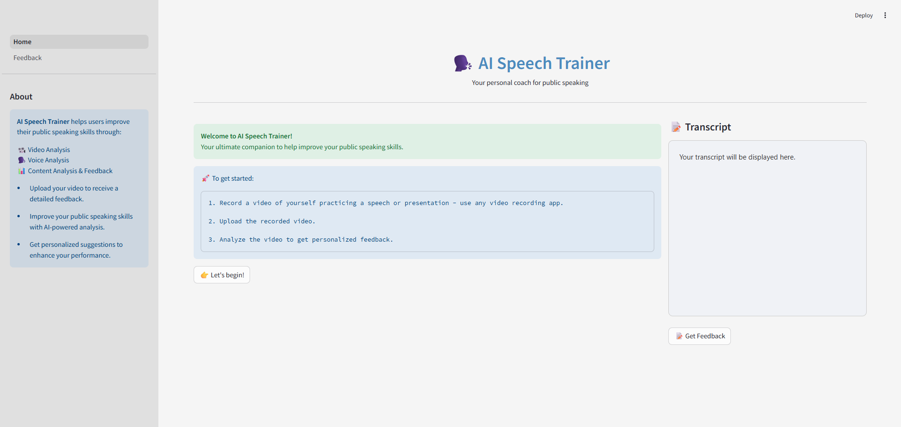
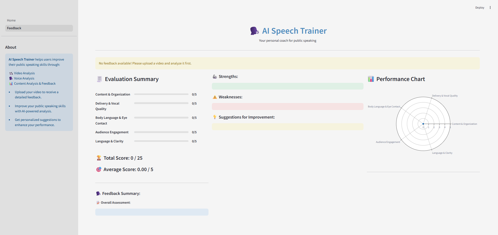

# AI Speech Trainer Agent
# `AI` 演讲训练智能体

## Overview
## 概览
AI Speech Trainer is an AI-powered multi-agent, multimodal public speaking coach that listens to how you speak, watches how you express, and evaluates what you say - helping you become a confident public speaker.
`AI Speech Trainer` 是一个由 `AI` 驱动的多智能体、多模态公众演讲教练，它会聆听你的表达方式、观察你的表现方式，并评估你说了什么，帮助你成为自信的公众演讲者。

Whether you're preparing for a TED talk, interview, or school presentation, AI Speech Trainer provides you with personalized feedback, helping you improve your public speaking skills - highlighting your strengths and weaknesses and giving you valuable suggestions to speak better, clearer, and more confidently.
无论你是在准备 `TED` 演讲、面试还是学校展示，`AI Speech Trainer` 都会提供个性化反馈，帮助你提升公众演讲技能，突出你的优势和弱点，并给出有价值的建议，让你说得更好、更清晰、更自信。

This project has been built as part of the **Global Agent Hackathon (May 2025)**. It leverages the power of multi-agent collaboration, real-time feedback, and multimodal analysis to help anyone become a confident and effective speaker.
该项目作为 **`Global Agent Hackathon (May 2025)`** 的一部分构建。它利用多智能体协作、实时反馈和多模态分析的能力，帮助任何人成为自信且高效的演讲者。

## Features
## 功能
### Core Features
### 核心功能
- **Facial Expression Analysis**: Emotion recognition and eye contact estimation
- **面部表情分析**：情绪识别和眼神接触估计
- **Audio Analysis**: Pace, pitch, clarity, and filler words
- **音频分析**：语速、音高、清晰度和填充词
- **Content Evaluation**: GPT-based feedback on structure, tone, and clarity
- **内容评估**：基于 `GPT` 对结构、语气和清晰度提供反馈
- **Personalized Feedback**: Average score, overall assessment, strengths, weaknesses, and suggestions for improvement
- **个性化反馈**：平均分、总体评估、优势、弱点和改进建议

### Agents
### 智能体
- **Facial Agent**: Analyzes expression, engagement, and eye contact
- **面部智能体**：分析表情、参与度和眼神接触
- **Vocal Agent**: Detects speech issues (speed, filler words, pitch)
- **语音智能体**：检测演讲问题（语速、填充词、音高）
- **Content Agent**: Uses LLMs to assess and improve content clarity
- **内容智能体**：使用 `LLM` 评估并提升内容清晰度
- **Feedback Agent**: Uses the responses from other agents to evaluate the speaker based on a scoring rubric
- **反馈智能体**：使用其他智能体的响应，基于评分规则评估演讲者
- **Coordinator Agent**: A team of agents - Orchestrates all analysis and feedback generation
- **协调智能体**：一个智能体团队，负责编排所有分析和反馈生成

## How It Works
## 工作原理
### **User Flow**: 
### **用户流程**：
1. User opens the Streamlit app and uploads a video of themselves practicing a speech or presentation.
1. 用户打开 `Streamlit` 应用，并上传自己练习演讲或展示的视频。

2. Multiple agents get into action:
2. 多个智能体开始工作：

- Facial Agent analyzes expressions and eye contact.
- `Facial Agent` 分析表情和眼神接触。
- Vocal Agent transcribes the speech and detects voice attributes.
- `Vocal Agent` 转录演讲并检测声音属性。
- Content Agent evaluates grammar, structure, and coherence.
- `Content Agent` 评估语法、结构和连贯性。
- Feedback agent provides feedback on the overall effectiveness of the speech.
- `Feedback Agent` 对演讲的整体效果提供反馈。
- A Coordinator Agent aggregates all agent insights.
- `Coordinator Agent` 汇总所有智能体洞察。

AI Speech Trainer presents a detailed feedback report including scores based on a rubric and summary of the feedback.
`AI Speech Trainer` 会展示详细反馈报告，包括基于评分规则的分数和反馈摘要。

### **Core Functionality**:
### **核心功能**：
- Facial emotion recognition using OpenCV, DeepFace, and Mediapipe landmarks.
- 使用 `OpenCV`、`DeepFace` 和 `Mediapipe` 标志点进行面部情绪识别。
- Voice transcription and analysis.
- 语音转录和分析。
- Content analysis using GPT-based feedback.
- 使用基于 `GPT` 的反馈进行内容分析。
- Aggregated evaluation score and feedback summary.
- 聚合评估分数和反馈摘要。

### **Multimodal Elements**:
### **多模态元素**：
- **Audio**: Speech input & voice quality analysis.
- **音频**：演讲输入和声音质量分析。
- **Video**: Facial expression tracking and feedback.
- **视频**：面部表情跟踪和反馈。
- **Text**: GPT-based feedback on structure, clarity, and tone.
- **文本**：基于 `GPT` 对结构、清晰度和语气提供反馈。

## Tech Stack
## 技术栈
### AI/ML Tools
### `AI/ML` 工具
- **Agno**: For building multi-agent collaboration and coordination.
- **`Agno`**：用于构建多智能体协作和协调。
- **Facial Expression Tool**: Facial emotion analysis - New customized tool.
- **面部表情工具**：面部情绪分析，新定制工具。
- **Voice Analysis Tool**: Voice transcription and analysis - New customized tool.
- **语音分析工具**：语音转录和分析，新定制工具。
- **Together API (Llama-3.3-70B-Instruct-Turbo-Free)**: LLM - Content analysis and feedback generation.
- **`Together API`（`Llama-3.3-70B-Instruct-Turbo-Free`）**：`LLM`，用于内容分析和反馈生成。

### Application Framework
### 应用框架
- **Streamlit**: Frontend for user interface.
- **`Streamlit`**：用户界面的前端。
- **FastAPI**: For backend API endpoints.
- **`FastAPI`**：用于后端 `API` 端点。

### Languages & Packages
### 语言和包
- **Python**: Core language for backend logic and agent implementation.
- **`Python`**：后端逻辑和智能体实现的核心语言。
- **OpenCV + DeepFace + Mediapipe**: For facial expression analysis
- **`OpenCV` + `DeepFace` + `Mediapipe`**：用于面部表情分析
- **Moviepy + Faster-Whisper + Librosa**: For voice analysis
- **`Moviepy` + `Faster-Whisper` + `Librosa`**：用于语音分析

## UI Approach
## `UI` 方式
Built with Streamlit, the UI includes:
使用 `Streamlit` 构建，`UI` 包括：

- Home page with Video Upload section, buttons, and a space for displaying the Transcript.
- 带有视频上传区域、按钮和显示转录内容区域的首页。
- Feedback page to display evaluation scores, detailed feedback, strengths, weaknesses, suggestions for improvement, and a performance chart.
- 用于展示评估分数、详细反馈、优势、弱点、改进建议和表现图表的反馈页面。

## Visuals
## 视觉材料
### High Level Architecture
### 高层架构


### Home Page
### 首页


### Feedback Page
### 反馈页面


## Setup Instructions
## 设置说明
### 1. Clone the repo
### 1. 克隆仓库
```sh
git clone https://github.com/aminajavaid30/ai_speech_trainer.git
cd ai_speech_trainer
```

### 2. Install dependencies
### 2. 安装依赖
```sh
pip install -r requirements.txt
```

### 3. **Add your API keys** - Create a .env file with:
### 3. **添加你的 `API key`** - 创建包含以下内容的 `.env` 文件：
```sh
TOGETHER_API_KEY=...
```

### 4. Initialize the backend
### 4. 初始化后端
Navigate to the **backend** folder and run the following command:
进入 **`backend`** 文件夹并运行以下命令：
```sh
uvicorn main:app --reload
```

### 5. Run the app
### 5. 运行应用
Navigate to the **frontend** folder and run the following command:
进入 **`frontend`** 文件夹并运行以下命令：
```sh
streamlit run Home.py
```

## Team Information
## 团队信息
- **Team Lead**: https://github.com/aminajavaid30 - Agentic System Designer and Developer
- **团队负责人**：https://github.com/aminajavaid30 - 智能体系统设计师和开发者
- **Team Members**: https://github.com/aminajavaid30 - Individual Project
- **团队成员**：https://github.com/aminajavaid30 - 个人项目
- **Background/Experience**: Data Scientist with a background in Software Engineering and Web Development. Experienced in building AI products and agentic workflows.
- **背景/经验**：具有软件工程和 `Web` 开发背景的数据科学家。拥有构建 `AI` 产品和智能体工作流的经验。

## Demo Video Link
## 演示视频链接
https://youtu.be/Sb0JPUpJTGQ

## Folder Structure
## 文件夹结构
```sh
/backend
  /agents
    /tools
      - facial_expression_tool.py
      - voice_analysis_tool.py
    - content_analysis_agent.py
    - coordinator_agent.py
    - facial_expression_agent.py
    - feedback_agent.py
    - voice_analysis_agent.py
  main.py (FastAPI App)
/frontend
  /pages
    - 1 - Feedback.py
  Home.py
  page_config.py
  sidebar.py
  style.css
.env
LICENSE
README.md
requirements.txt
```

## Additional Notes
## 补充说明
- This project has been designed to utilize the capabilities of **Agno** as an AI agent development platform. It depicts the potential of Agno as a team of collaborative agents working together seamlessly in order to address a real-world challenge - analyzing speech presentations by users and providing them with comprehensive evaluation and feedback to improve their public speaking skills. Each individual agent has a clear cut goal to follow and together they coordinate as a team to solve a complex multimodal problem.
- 该项目旨在利用 **`Agno`** 作为 `AI Agent` 开发平台的能力。它展示了 `Agno` 作为协作智能体团队无缝协作的潜力，用于解决真实世界挑战，即分析用户的演讲展示，并提供全面评估和反馈，以提升用户的公众演讲技能。每个独立智能体都有明确目标，并共同作为团队协调，解决复杂的多模态问题。

- This project has a huge potential for further enhancements. It could be a starting point for a more comprehensive and useful agentic systsem. Some of the proposed additional functionalities could be:
- 该项目有很大的进一步增强潜力。它可以作为更全面、更实用的智能体系统的起点。一些拟议的附加功能包括：
  1. Incorporating real-time video recording and conversational capabilities through different role scenarios.
  1. 通过不同角色场景加入实时视频录制和对话能力。
  2. Playing back the user speech through an AI avatar to help users learn and understand best speaking practices.
  2. 通过 `AI avatar` 回放用户演讲，帮助用户学习并理解最佳演讲实践。
  3. Keeping a record of user sessions.
  3. 保留用户会话记录。
  4. Including a performance dashboard to track user performance over time.
  4. 加入表现仪表板，用于长期跟踪用户表现。

   Each of these additional functionalities could be added by implementing specific goal-oriented agents in the system.
   这些附加功能都可以通过在系统中实现特定目标导向的智能体来添加。

## Limitations
## 限制
- **Together API** with **meta-llama/Llama-3.3-70B-Instruct-Turbo-Free** as LLM has a small token limit, therefore, it works with small video clips (15-30 seconds).
- 以 **`meta-llama/Llama-3.3-70B-Instruct-Turbo-Free`** 作为 `LLM` 的 **`Together API`** 具有较小的 `token` 限制，因此适用于小型视频片段（`15-30` 秒）。
- Use other LLM options for longer video clips. Don't forget to add their API keys in the *.env* file. 
- 对于更长的视频片段，请使用其他 `LLM` 选项。不要忘记在 `*.env*` 文件中添加它们的 `API key`。

## Acknowledgements
## 致谢
Built for the **#GlobalAgentHackathonMay2025** using Agno, Streamlit, Together API, and FastAPI.
使用 `Agno`、`Streamlit`、`Together API` 和 `FastAPI` 为 **`#GlobalAgentHackathonMay2025`** 构建。
