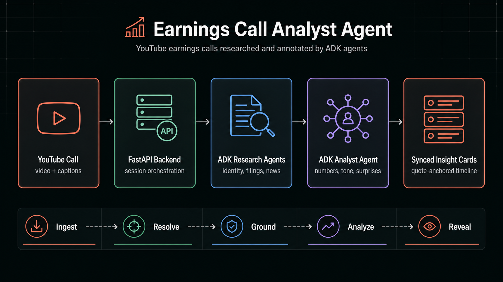

# 📡 Earnings Call Analyst Agent
# 📡 财报电话会议分析智能体

An investor-grade earnings call companion that turns any YouTube earnings call into a playback-synced analyst workspace. Paste a call URL, watch the video, and let ADK agents surface the numbers, tone shifts, filing context, and market-moving surprises that are easy to miss in a live call.
一个投资者级别的财报电话会议助手，可将任意 `YouTube` 财报电话会议转换为与播放同步的分析师工作区。粘贴会议 `URL`、观看视频，并让 `ADK agents` 呈现数字、语气变化、申报文件上下文，以及在直播会议中容易错过且可能影响市场的意外信息。

This is built for the real earnings workflow: instead of reading a transcript after the fact, you can follow management commentary with an agentic research layer that keeps every insight tied to the quote that triggered it.
它面向真实财报工作流构建：你无需事后阅读转录稿，而是可以跟随管理层评论，通过智能体研究层查看每条洞察，并让每条洞察都关联到触发它的原始引述。



## Features
## 功能

### Agentic Call Research
### 智能体电话会议研究

- Identifies the company, ticker, fiscal period, and peer set from the YouTube metadata and transcript opening
- 从 `YouTube` 元数据和转录稿开头识别公司、股票代码、财务期间和同业集合
- Builds a research pack with SEC filings and current market context
- 使用 `SEC` 申报文件和当前市场上下文构建研究包
- Uses an ADK news agent with Google Search grounding for current market context
- 使用带有 `Google Search grounding` 的 `ADK news agent` 获取当前市场上下文
- Hides unresolved context instead of showing empty research panels
- 隐藏未解析的上下文，而不是显示空研究面板

### Quote-Anchored Signal Detection
### 基于引述锚定的信号检测

- Creates analyst cards only when the transcript contains a real investor signal
- 仅在转录稿包含真实投资者信号时创建分析师卡片
- Anchors every card to the exact quote and timestamp that triggered it
- 将每张卡片锚定到触发它的准确引述和时间戳
- Filters out greetings, safe-harbor boilerplate, and generic upbeat commentary
- 过滤问候语、安全港样板文字和泛泛的乐观评论
- Reveals cards as playback reaches the relevant moment in the call
- 当播放到会议中的相关时刻时显示卡片

### Earnings Intelligence Cards
### 财报情报卡片

- Flags financial metrics, margin pressure, guidance language, demand commentary, pricing, cash flow, and capex signals
- 标记财务指标、利润率压力、指引措辞、需求评论、定价、现金流和资本支出信号
- Separates company-specific statements from peer or sector context when evidence is available
- 在有证据时，将公司特定陈述与同业或行业上下文分开
- Calls out CFO hedging, confidence shifts, defensiveness, and unusually specific language
- 指出 `CFO` 的含糊措辞、信心变化、防御性表达和异常具体的语言
- Adds compact tables or chart summaries only when they clarify the finding
- 仅在能澄清发现时添加紧凑表格或图表摘要

### Caption + Audio Resilience
### 字幕 + 音频韧性

- Uses YouTube captions when available for precise timestamps
- 在可用时使用 `YouTube` 字幕获得精确时间戳
- Falls back to ADK-powered audio transcription for captionless videos
- 对无字幕视频回退到由 `ADK` 驱动的音频转录
- Realigns generated cards to the closest caption segment so the video and quote stay in sync
- 将生成的卡片重新对齐到最近的字幕片段，使视频和引述保持同步
- Keeps the transcript, research pack, and analyst cards tied to the same source timeline
- 让转录稿、研究包和分析师卡片都绑定到同一源时间线

## How to get Started?
## 如何开始？

This agent lives in `advanced_ai_agents/single_agent_apps/earnings_call_analyst_agent`.
这个智能体位于 `advanced_ai_agents/single_agent_apps/earnings_call_analyst_agent`。

1. Clone the GitHub repository
   克隆 `GitHub` 仓库

```bash
git clone https://github.com/Shubhamsaboo/awesome-llm-apps.git
cd advanced_ai_agents/single_agent_apps/earnings_call_analyst_agent
```

2. Install the required dependencies:
   安装所需依赖：

```bash
python3 -m venv .venv
source .venv/bin/activate
pip install -r requirements.txt
```

3. Configure Vertex AI or Gemini API key:
   配置 `Vertex AI` 或 `Gemini API key`：

```bash
cp .env.example .env
```

For Vertex AI / Google Cloud auth:
对于 `Vertex AI` / `Google Cloud` 认证：

```bash
GOOGLE_GENAI_USE_VERTEXAI=True
GOOGLE_CLOUD_PROJECT=your-google-cloud-project-id
GOOGLE_CLOUD_LOCATION=global
```

For Gemini API key auth:
对于 `Gemini API key` 认证：

```bash
GOOGLE_GENAI_USE_VERTEXAI=False
GOOGLE_API_KEY=your-google-api-key
```

4. Run the FastAPI app:
   运行 `FastAPI` 应用：

```bash
PYTHONPATH=.. python -m uvicorn earnings_call_analyst_agent.live_demo.server:app --host 127.0.0.1 --port 4188
```

5. Open the app:
   打开应用：

```text
http://127.0.0.1:4188
```

Paste a YouTube earnings call URL. The app builds the research pack first, then reveals analyst cards as the video reaches each quote.
粘贴一个 `YouTube` 财报电话会议 `URL`。应用会先构建研究包，然后在视频播放到每条引述时显示分析师卡片。
