# awesome-llm-apps 项目导航与 Code Graph

> 生成日期：2026-07-27  
> 适用对象：第一次接触本仓库、希望系统学习 AI Agent 的开发者

## 一句话理解

`awesome-llm-apps` 是一个按能力主题收集的 LLM / AI Agent 实战示例仓库，而不是需要整体启动的单体产品。它把从单 Agent、工具调用、结构化输出，到 RAG、MCP、多 Agent、语音和生成式 UI 的实现放在相对独立的目录中，适合作为“可运行案例索引”和渐进式学习材料。

阅读时请把每个子目录看作独立小项目：通常有自己的 `README`、依赖清单、环境变量示例和启动入口。

## 仓库 Code Graph

```mermaid
flowchart TD
    ROOT[awesome-llm-apps\nAI/LLM 应用示例集合]

    ROOT --> STARTER[starter_ai_agents\n单场景 Agent 入门]
    ROOT --> COURSE[ai_agent_framework_crash_course\n框架能力课程]
    ROOT --> RAG[rag_tutorials\n检索增强生成]
    ROOT --> MCP[mcp_ai_agents\nMCP 工具与服务连接]
    ROOT --> ADV[advanced_ai_agents\n单/多/自主 Agent]
    ROOT --> VOICE[voice_ai_agents\n语音与实时交互]
    ROOT --> ALWAYS[always_on_agents\n长期运行与定时任务]
    ROOT --> SKILLS[agent_skills\n可复用技能与评测]
    ROOT --> GUI[generative_ui_agents\nAgent 驱动界面]
    ROOT --> APPS[advanced_llm_apps\n完整 LLM 应用]

    STARTER --> S1[研究、旅行、网页抓取]
    STARTER --> S2[数据分析/可视化、多模态]
    STARTER --> S3[推理、金融、混合专家]

    COURSE --> OAI[OpenAI SDK Crash Course]
    COURSE --> GADK[Google ADK Crash Course]
    OAI --> O1[Agent 基础]
    OAI --> O2[结构化输出]
    OAI --> O3[函数/内置工具]
    OAI --> O4[运行、流式输出与会话]
    OAI --> O5[上下文、Guardrails、追踪]
    OAI --> O6[交接与多 Agent 编排]
    OAI --> O7[语音]

    RAG --> R1[RAG Chain / RAG as a Service]
    RAG --> R2[混合检索、路由、纠错 RAG]
    RAG --> R3[Agentic / 多模态 / 视觉 RAG]
    RAG --> R4[知识图谱 RAG 与引用]

    MCP --> M1[浏览器、GitHub、Notion 等外部能力]
    MCP --> M2[多 MCP Agent]
    MCP --> M3[MCP Router / Agent Forge]

    ADV --> A1[单 Agent 应用]
    ADV --> A2[多 Agent 应用]
    ADV --> A3[自主游戏 Agent]

    VOICE --> V1[客服与音频导览]
    VOICE --> V2[保险理赔实时 Agent 团队]
    VOICE --> V3[语音 RAG]

    ALWAYS --> L1[HN Scout]
    ALWAYS --> L2[调度 API]
    ALWAYS --> L3[内容投递]

    SKILLS --> K1[Advisor / Orchestrator / Worker Skill]
    SKILLS --> K2[Project Graveyard Skill]
    SKILLS --> K3[自改进 Skill 与评测工具]

    GUI --> U1[Deep Research / Financial Coach]
    GUI --> U2[Dashboard Canvas]
    GUI --> U3[MCP App Builder / 组件生成器]
```



这张图表达的是学习和能力依赖，而非 Python/TypeScript 函数调用关系：仓库由多个独立项目组成，跨目录通常没有运行时依赖。

## 项目结构

| 目录 | 主要内容 | 适合解决的问题 |
| --- | --- | --- |
| `starter_ai_agents/` | 旅行、研究、网页抓取、数据分析、图像/音频等场景 Agent | 先理解一个 Agent 如何接收任务、调用模型和产出结果 |
| `ai_agent_framework_crash_course/` | OpenAI SDK 与 Google ADK 的分阶段课程 | 用最小代码建立 Agent 基础能力模型 |
| `rag_tutorials/` | 基础、混合、纠错、路由、视觉、Agentic RAG | 让 Agent 基于私有知识可靠回答 |
| `mcp_ai_agents/` | 浏览器、GitHub、Notion、多服务路由等 MCP 示例 | 将外部工具和数据源以标准协议交给 Agent 使用 |
| `advanced_ai_agents/` | 单 Agent、多 Agent、自主游戏等 | 研究复杂任务分解与协作策略 |
| `voice_ai_agents/` | 语音客服、实时团队、音频导览、语音 RAG | 处理语音输入/输出与实时对话链路 |
| `always_on_agents/` | HN 简报 Scout、调度 API、投递 | 将一次性脚本升级为持续运行的服务 |
| `agent_skills/` | Skill 定义、评测、技能优化应用 | 把提示词和工作流产品化、可测试化 |
| `generative_ui_agents/` | Deep Research、可编辑仪表盘、MCP App、UI 组件生成 | 让 Agent 与前端状态、工具调用和可视化界面协同 |
| `advanced_llm_apps/` | 更完整的应用案例 | 观察 LLM 功能如何进入实际产品界面 |

`docs/` 目前以图片等仓库文档资源为主。本文件放在这里，作为新成员的起点。

## 最值得先读的代码路径

若目标是学习 AI Agent，不建议随机挑一个“看起来最酷”的项目直接启动。以下路径能以最低的概念跳跃建立正确心智模型：

1. `ai_agent_framework_crash_course/openai_sdk_crash_course/1_starter_agent/`
   - 先看到 Agent 的定义、指令和一次运行。

2. `ai_agent_framework_crash_course/openai_sdk_crash_course/2_structured_output_agent/`
   - 学会让模型输出可解析的数据，而不只是自然语言。

3. `ai_agent_framework_crash_course/openai_sdk_crash_course/3_tool_using_agent/`
   - 学函数工具、内置工具和“Agent 作为工具”。这是 Agent 区别于普通聊天机器人的关键一步。

4. `ai_agent_framework_crash_course/openai_sdk_crash_course/4_running_agents/` 与 `7_sessions/`
   - 理解同步/异步、流式事件、会话和记忆；这些决定应用能否稳定进入产品环境。

5. `ai_agent_framework_crash_course/openai_sdk_crash_course/5_context_management/`、`6_guardrails_validation/`、`10_tracing_observability/`
   - 学会控制上下文、约束危险行为、追踪一次运行发生了什么。

6. `ai_agent_framework_crash_course/openai_sdk_crash_course/8_handoffs_delegation/` 与 `9_multi_agent_orchestration/`
   - 在单 Agent 能稳定完成任务后，再学习交接、并行执行和专家协作。

7. `rag_tutorials/rag_chain/`、`rag_tutorials/hybrid_search_rag/`、`rag_tutorials/rag_failure_diagnostics_clinic/`
   - 依次理解基础检索、召回质量和失败诊断，不要只停留在“接向量库”。

8. `mcp_ai_agents/` 与 `agent_skills/`
   - 将工具接入标准化，并将重复工作流沉淀为可复用、可评测的 Skill。

9. `always_on_agents/`、`generative_ui_agents/`、`voice_ai_agents/`
   - 最后学习部署形态：长期运行、用户界面和多模态实时交互。

## 作为 AI Agent 开发者，你能学到什么

### 1. Agent 的最小闭环

一个可用 Agent 并不是“给模型一段 Prompt”。完整闭环至少包括：任务指令、模型调用、工具选择、工具结果回填、输出格式、状态/会话和失败处理。课程目录按这个顺序展开，适合把抽象概念落到代码。

### 2. 结构化输出是可靠性的起点

支持工单、产品评价等结构化输出示例说明：下游程序不应依赖从自然语言中猜字段。应该优先定义 schema，再用验证失败、重试或人工兜底处理异常。

### 3. Tool Calling 才让模型具备行动能力

计算器、浏览器、GitHub、Notion、网页抓取等案例共同展示同一原则：模型负责决定“何时调用什么”，应用代码负责提供受控、可审计、可测试的实际能力。

### 4. RAG 是信息系统，不是单一 API 调用

本仓库覆盖的混合检索、数据库路由、纠错 RAG、引用与失败诊断提示了完整问题：切分、嵌入、召回、重排、上下文组装、答案溯源和评估，任何一环薄弱都会使回答看似流畅但不可靠。

### 5. 多 Agent 的价值来自清晰分工

交接、并行执行、Agent-as-tools 和多 MCP 路由案例适合学习：何时拆分角色、如何定义输入输出契约、如何聚合结果、如何限制循环和成本。多 Agent 不是默认架构；当单 Agent 的工具集、上下文或职责难以管理时才值得使用。

### 6. Agent 要可观测、可约束、可评测

追踪、Guardrails、`agent_skills/evals/` 这几部分比“换一个更强的模型”更接近工程能力。你应该能回答：为什么它调用了这个工具？输入输出是什么？失败是否被发现？新 Prompt 是否真的变好？

### 7. Agent 的最终形态是产品，而非命令行 Demo

生成式 UI、持续运行 Agent、语音 Agent 让你接触真实产品问题：前端状态与 Agent 状态如何同步、如何展示工具过程、如何调度任务、如何投递结果，以及如何设计人工接管点。

## 根 README 双语导读

以下以当前 Git 版本的根 `README.md` 为准。工作区中的 `README.md` 文件目前不是可读文本，因而没有直接引用它的字节内容。为避免重复图片、徽章、贡献者图和外链，本节保留与学习有关的英文原文，并紧随中文翻译；项目链接仍以根 README 为准。

### Why this exists / 为什么有这个仓库

> You shouldn't have to rebuild the same RAG pipeline, agent loop, or MCP integration from scratch every time you start a new LLM project.

你不应当每开始一个 LLM 项目，就从零重复搭建同一套 RAG 流水线、Agent 循环或 MCP 集成。

> **Awesome LLM Apps is a cookbook of ready-to-run templates** - starter code you can fork, customize, and ship as a production LLM app. Every template here is self-contained with full source code, not collected from elsewhere.

**Awesome LLM Apps 是一套可直接运行的模板手册**：你可以 Fork、定制并交付为生产级 LLM 应用。每个模板都是包含完整源代码的独立项目，不是从其他地方收集来的片段。

| English | 中文 |
| --- | --- |
| Hand-built, not curated - every template is original work, tested end-to-end before it ships. | 亲手构建，而非仅做收集：每个模板都是原创，并在发布前经过端到端测试。 |
| Runs in 3 commands - no broken `requirements.txt`, no "figure it out yourself" scaffolding. | 三条命令即可运行：不应有失效的 `requirements.txt`，也不依赖你自行摸索的空脚手架。 |
| Covers the modern AI stack - AI Agents, Always-on Agents, Multi-agent Teams, MCP Agents, Voice AI Agents, RAG, Agent Skills, Fine-tuning. | 覆盖现代 AI 技术栈：AI Agent、常驻 Agent、多 Agent 团队、MCP Agent、语音 Agent、RAG、Agent Skill 与微调。 |
| Provider-agnostic - switch between Claude, Gemini, GPT, Llama, Qwen, xAI and others with a config change. | 不绑定单一供应商：可通过配置在 Claude、Gemini、GPT、Llama、Qwen、xAI 等模型之间切换。 |
| Step-by-step tutorials - every featured template has a free walkthrough on Unwind AI. | 分步教程：每个精选模板在 Unwind AI 上都有免费的操作讲解。 |
| Apache-2.0 - fork it, ship it, sell it. No paywall, no signup, no telemetry. | Apache-2.0 许可：可 Fork、发布和商用；没有付费墙、注册要求或遥测。 |

### Quick Start / 快速开始

> Run your first agent in **30 seconds**:

在 **30 秒**内运行你的第一个 Agent：

```bash
git clone https://github.com/Shubhamsaboo/awesome-llm-apps.git
cd awesome-llm-apps/starter_ai_agents/ai_travel_agent
pip install -r requirements.txt
streamlit run travel_agent.py
```

这里的命令只对应 `ai_travel_agent`。其他示例必须进入各自目录、按各自 README 安装依赖和启动，不能把这四条命令当作整个仓库的通用启动方法。

### Featured This Month / 本月精选

| English template and description | 中文释义 |
| --- | --- |
| Project Graveyard Skill - Finds your dead side projects, tells you why each one died, and helps you finish the one worth going back to. | 项目墓地 Skill：找出被搁置的个人项目，分析每个项目停止的原因，并帮助你完成最值得重启的一个。 |
| Always-on Hacker News Briefing Agent - Scheduled Hacker News scout that filters AI agent and LLM app signals into a delivery-ready daily brief. | 常驻 Hacker News 简报 Agent：按计划扫描 Hacker News，将 AI Agent 和 LLM 应用信号筛选为可投递的日报。 |
| Insurance Claim Live Agent Team - Real-time voice claim intake with Gemini Live and ADK. | 保险理赔实时 Agent 团队：借助 Gemini Live 与 ADK，实时通过语音收集理赔信息。 |
| Home Renovation Agent - Photo to AI redesign with Nano Banana Pro. | 家装 Agent：将照片转为 AI 设计改造方案，使用 Nano Banana Pro。 |
| Self-Improving Agent Skills - Automatically optimize agent skills using Gemini and ADK. | 自我改进 Agent Skills：使用 Gemini 和 ADK 自动优化 Agent Skill。 |

### Categories and project names / 分类与项目名称

下表保留 README 的英文分类说明，并给出相应中文。学习时先按分类选择，不需要一次浏览所有项目。

| README English | 中文翻译与学习重点 |
| --- | --- |
| **Agent Skills**: Give your coding agent new abilities. One command to install, plain English to use. | **Agent Skills（Agent 技能）**：为编码 Agent 增加能力；一条命令安装，用自然语言调用。重点是把重复流程写成可复用、可验收的能力。 |
| **Starter AI Agents**: Single-file agents that run with just an API key - a great place to start. | **入门 AI Agent**：只需 API Key 就能运行的单文件 Agent，是最适合起步的分类。 |
| **Advanced AI Agents**: Production-style agents with tools, memory, and multi-step reasoning. | **高级 AI Agent**：具有工具、记忆和多步推理的生产式 Agent。应在单 Agent 基础稳定后学习。 |
| **Always-on Agents**: Background agents that run on schedules or events, monitor changing context, decide what needs attention, and proactively deliver updates, artifacts, or actions. | **常驻 Agent**：由定时任务或事件驱动，在后台监控变化的上下文，判断需要关注的内容，并主动投递更新、产物或动作。 |
| **Multi-agent Teams**: Multiple agents collaborating to accomplish complex, cross-domain tasks. | **多 Agent 团队**：多个 Agent 协作完成复杂、跨领域任务。先定义角色边界和交接契约。 |
| **Voice AI Agents**: Speech-in, speech-out agents using real-time voice APIs. | **语音 AI Agent**：使用实时语音 API，实现语音输入和语音输出。 |
| **Generative UI and Agentic Frontends**: Agents that render interactive UI components - forms, cards, charts, editable plans - not just text. | **生成式 UI 与 Agent 前端**：Agent 能渲染表单、卡片、图表、可编辑计划等交互组件，而不只输出文本。 |
| **Autonomous Game-Playing Agents**: Agents that play games end-to-end - reasoning, strategy, and action. | **自主游戏 Agent**：端到端完成推理、策略和动作的游戏 Agent。 |
| **MCP AI Agents**: Agents that connect to external tools and data via Model Context Protocol. | **MCP AI Agent**：通过 Model Context Protocol 连接外部工具和数据的 Agent。重点关注权限和参数边界。 |
| **RAG (Retrieval Augmented Generation)**: Retrieval pipelines - from simple chains to agentic and multi-source. | **RAG（检索增强生成）**：从简单链路到 Agentic、多数据源的检索流水线。重点是评估召回、来源和失败。 |
| **LLM Apps with Memory Tutorials**: Agents and chatbots that remember conversations and user state across sessions. | **带记忆的 LLM 应用教程**：能跨会话保存对话和用户状态的 Agent 或聊天机器人。 |
| **Chat with X Tutorials**: Turn any data source into a chat interface. | **与 X 对话教程**：把任意数据源转为聊天交互界面。 |
| **LLM Optimization Tools**: Reduce token usage, context size, and API cost without losing quality. | **LLM 优化工具**：在尽量不损失质量的前提下，降低 Token 用量、上下文大小和 API 成本。 |
| **LLM Fine-tuning Tutorials**: End-to-end fine-tuning recipes for open-source models. | **LLM 微调教程**：开源模型的端到端微调方案。应在提示词、RAG 和评估不足以解决问题后再考虑。 |
| **AI Agent Framework Crash Course**: Deep-dive tutorials on the major agent frameworks. | **AI Agent 框架速成课程**：主流 Agent 框架的深入教程，是本学习计划的主线入口。 |

### Project titles / 项目标题对照

以下为根 README 中最适合按计划进入的项目名对照；英文名是目录与 README 中应当搜索的原词，中文仅用于理解，不改动目录名称。

| 分类 | English project title | 中文 |
| --- | --- | --- |
| Agent Skills | Project Graveyard; Advisor Orchestrator Worker; Self-Improving Agent Skills | 项目墓地；顾问-编排器-执行者；自我改进 Agent 技能 |
| Starter | AI Blog to Podcast Agent; AI Data Analysis Agent; AI Travel Agent; Gemini Multimodal Agent; Mixture of Agents; OpenAI Research Agent; Web Scraping AI Agent | 博客转播客 Agent；数据分析 Agent；旅行 Agent；Gemini 多模态 Agent；Agent 混合专家；OpenAI 研究 Agent；网页抓取 Agent |
| Advanced | AI Deep Research Agent; AI Consultant Agent; AI System Architect Agent; AI Financial Coach Agent; AI Meeting Agent; Trust-Gated Multi-Agent Research Team | 深度研究 Agent；顾问 Agent；系统架构师 Agent；财务教练 Agent；会议 Agent；信任门控多 Agent 研究团队 |
| Teams | AI Competitor Intelligence Agent Team; AI Finance Agent Team; AI Game Design Agent Team; AI Legal Agent Team; AI Recruitment Agent Team; AI Travel Planner Agent Team | 竞品情报团队；金融团队；游戏设计团队；法律团队；招聘团队；旅行规划团队 |
| Voice | AI Audio Tour Agent; Customer Support Voice Agent; Insurance Claim Live Agent Team; Voice RAG Agent | 音频导览 Agent；客服语音 Agent；保险理赔实时团队；语音 RAG Agent |
| Generative UI | Generative UI Starter Project; AI Financial Coach Agent; AI Dashboard Canvas Agent; AI MCP App Builder; MCP Apps Generative UI Showcase; AI Shadcn Component Generator | 生成式 UI 起步项目；财务教练 Agent；AI 仪表盘画布 Agent；AI MCP 应用构建器；MCP 应用生成式 UI 展示；AI Shadcn 组件生成器 |
| MCP | Browser MCP Agent; GitHub MCP Agent; Notion MCP Agent; AI Travel Planner MCP Agent; Multi-MCP Agent Router | 浏览器 MCP Agent；GitHub MCP Agent；Notion MCP Agent；旅行规划 MCP Agent；多 MCP Agent 路由器 |
| RAG | Agentic RAG with Reasoning; Hybrid Search RAG; Multimodal Agentic RAG; RAG-as-a-Service; Basic RAG Chain; RAG Failure Diagnostics Clinic; Knowledge Graph RAG with Citations | 带推理的 Agentic RAG；混合检索 RAG；多模态 Agentic RAG；RAG 即服务；基础 RAG 链；RAG 失败诊断门诊；带引用的知识图谱 RAG |
| Memory / Chat | AI ArXiv Agent with Memory; LLM App with Personalized Memory; Chat with GitHub; Chat with PDF; Chat with YouTube Videos | 带记忆的 ArXiv Agent；带个性化记忆的 LLM 应用；与 GitHub/PDF/YouTube 视频对话 |
| Optimization / Fine-tuning | Toonify Token Optimization; Headroom Context Optimization; Gemma 3 Fine-tuning; Llama 3.2 Fine-tuning | Toonify Token 优化；Headroom 上下文优化；Gemma 3 微调；Llama 3.2 微调 |

### Framework Crash Course / 框架课程对照

> Google ADK Crash Course: Starter agent; model-agnostic (OpenAI, Claude); structured outputs (Pydantic); built-in, function, third-party and MCP tools; memory, callbacks, plugins; simple multi-agent and multi-agent patterns.

**Google ADK 速成课程**：包括入门 Agent；模型无关设计（可接 OpenAI、Claude）；结构化输出（Pydantic）；内置函数、第三方和 MCP 工具；记忆、回调、插件；简单多 Agent 与多 Agent 模式。

> OpenAI Agents SDK Crash Course: Starter agent; function calling; structured outputs; built-in tools, functions and third-party integrations; memory, callbacks, evaluation; multi-agent patterns, agent handoffs; swarm orchestration and routing logic.

**OpenAI Agents SDK 速成课程**：包括入门 Agent、函数调用、结构化输出；内置工具、函数和第三方集成；记忆、回调、评估；多 Agent 模式与 Agent 交接；群体编排和路由逻辑。

## 阅读与运行注意事项

- 不要在仓库根目录寻找统一的启动命令或统一依赖；应进入某一个示例目录，先读其 README、`requirements.txt` / `package.json` 和 `env.example`。
- API Key 应只存在于本地环境变量或未提交的 `.env` 文件中，绝不写入示例代码或提交记录。
- 先跑最小示例，逐项替换模型、提示词、工具和数据源；一次改动过多会让你难以判断问题来自哪里。
- 当前工作区中的多数 `.py` 与 `.md` 文件以相同的非文本字节开头，无法直接进行源码级审阅。本文基于目录、入口文件名和可识别索引生成；恢复可读源码后，应再补充函数/模块级调用图。

## 接下来可以做什么

从 `1_starter_agent` 开始，选择一个与自己工作最接近的任务，在不引入多 Agent、RAG 或前端的前提下实现一个最小版本。随后再按本文路径逐层添加能力，每次只新增一个可验证的组件。
