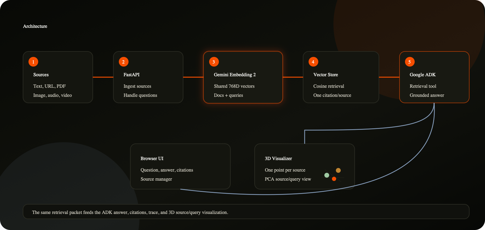

# Multimodal Agentic RAG
# 多模态 `Agentic RAG`

This is a multimodal RAG app built with Gemini Embedding 2 and Google ADK. Add text, URLs, PDFs, images, audio, or video; ask a question; and get a grounded answer with clear citations.
这是一个使用 `Gemini Embedding 2` 和 `Google ADK` 构建的多模态 `RAG` 应用。添加文本、`URL`、`PDF`、图像、音频或视频，提出问题，并获得带有清晰引用依据的扎实答案。

The UI includes a 3D embedding view for inspecting the search space. Each source appears as one point. When you ask a question, the query is projected into the same space and the cited sources are highlighted.
`UI` 包含一个 `3D` 嵌入视图，用于检查搜索空间。每个来源显示为一个点。当你提出问题时，查询会被投影到同一空间中，并高亮显示被引用的来源。


架构图：`assets/multimodal-agentic-rag-architecture.png`

## What It Does
## 它能做什么

- Adds and removes multimodal sources from a local in-memory index.
- 从本地内存索引中添加和移除多模态来源。
- Uses Gemini Embedding 2 for source and query embeddings.
- 使用 `Gemini Embedding 2` 为来源和查询生成嵌入。
- Requires `GOOGLE_API_KEY`; the app does not use local vector or answer fallbacks.
- 需要 `GOOGLE_API_KEY`；该应用不使用本地向量或答案回退方案。
- Retrieves evidence with cosine similarity over the stored embeddings.
- 基于已存储嵌入的余弦相似度检索证据。
- Runs a Google ADK agent to coordinate answer generation from the retrieved context.
- 运行 `Google ADK agent`，协调基于检索上下文的答案生成。
- Shows citations separately from the answer text so citation IDs do not clutter the response.
- 将引用与答案正文分开显示，避免引用 `ID` 干扰响应内容。
- Projects source and query vectors into a 3D PCA view for inspection.
- 将来源向量和查询向量投影到 `3D PCA` 视图中以便检查。

## Architecture
## 架构

| Layer<br>层 | Role<br>角色 |
| --- | --- |
| React + Vite frontend<br>`React + Vite` 前端 | Source manager, Q&A panel, citations, trace, and 3D embedding view<br>来源管理器、问答面板、引用、追踪和 `3D` 嵌入视图 |
| FastAPI backend<br>`FastAPI` 后端 | Ingestion, retrieval, answer API, and embedding-space snapshots<br>摄取、检索、答案 `API` 和嵌入空间快照 |
| `MultimodalRagStore`<br>`MultimodalRagStore` | In-memory source metadata, chunks, embeddings, search, and PCA projection<br>内存中的来源元数据、文本块、嵌入、搜索和 `PCA` 投影 |
| Gemini Embedding 2<br>`Gemini Embedding 2` | Source and query embeddings across supported modalities<br>跨支持模态的来源和查询嵌入 |
| Google ADK agent<br>`Google ADK agent` | Answer coordinator that receives the same retrieval packet shown in the UI<br>答案协调器，接收与 `UI` 中显示内容相同的检索包 |

The important implementation detail is that `/ask` performs retrieval once and passes that same retrieval packet into the ADK answer flow. The answer and the citation panel are therefore based on the same ranked evidence.
重要的实现细节是，`/ask` 只执行一次检索，并将同一个检索包传入 `ADK` 答案流程。因此，答案和引用面板都基于同一组排序后的证据。

## Project Structure
## 项目结构

```text
rag_tutorials/multimodal_agentic_rag/
|-- README.md
|-- assets/
|   `-- multimodal-agentic-rag-architecture.png
|-- backend/
|   |-- app_state.py
|   |-- rag_store.py
|   |-- requirements.txt
|   |-- server.py
|   `-- agentic_rag_agent/
|       |-- __init__.py
|       `-- agent.py
`-- frontend/
    |-- index.html
    |-- package.json
    |-- src/
    |   |-- App.tsx
    |   |-- main.tsx
    |   `-- styles.css
    |-- tsconfig.json
    `-- vite.config.ts
```

## Run Locally
## 本地运行

Start the backend:
启动后端：

```bash
cd rag_tutorials/multimodal_agentic_rag/backend
python3 -m venv .venv
source .venv/bin/activate
pip install -r requirements.txt
export GOOGLE_API_KEY="your-google-ai-studio-key"
python server.py
```

The backend runs at:
后端运行地址：

```text
http://localhost:8897
```

Start the frontend in another terminal:
在另一个终端中启动前端：

```bash
cd rag_tutorials/multimodal_agentic_rag/frontend
npm install
npm run dev -- --port 5177
```

The frontend runs at:
前端运行地址：

```text
http://localhost:5177
```

If the backend is on a different port:
如果后端运行在其他端口：

```bash
VITE_API_URL=http://localhost:8897 npm run dev -- --port 5177
```

## Try It
## 试用

1. Open `http://localhost:5177`.
1. 打开 `http://localhost:5177`。
2. Add a text, URL, PDF, image, audio, or video source.
2. 添加文本、`URL`、`PDF`、图像、音频或视频来源。
3. Ask a question in the Q&A panel.
3. 在问答面板中提出问题。
4. Review the answer and citations.
4. 查看答案和引用。
5. Inspect the source and query points in the embedding view.
5. 在嵌入视图中检查来源点和查询点。

## API
## `API`

| Method<br>方法 | Endpoint<br>端点 | Description<br>说明 |
| --- | --- | --- |
| `GET` | `/health` | Backend status, ADK availability, provider, dimensions, and source counts<br>后端状态、`ADK` 可用性、提供方、维度和来源数量 |
| `GET` | `/space` | Current sources, projected points, event trail, and projection metadata<br>当前来源、投影点、事件轨迹和投影元数据 |
| `POST` | `/sources/text` | Add a text source<br>添加文本来源 |
| `POST` | `/sources/url` | Fetch and index a public URL<br>获取并索引公开 `URL` |
| `POST` | `/sources/file` | Upload and index a PDF, image, audio, or video<br>上传并索引 `PDF`、图像、音频或视频 |
| `DELETE` | `/sources/{source_id}` | Remove a source and its chunks<br>移除来源及其文本块 |
| `POST` | `/ask` | Retrieve evidence, run the ADK answer flow, and return citations<br>检索证据、运行 `ADK` 答案流程并返回引用 |

## Notes
## 注意事项

- Storage is in memory. Restarting the backend resets the demo index.
- 存储位于内存中。重启后端会重置演示索引。
- URL ingestion blocks localhost and private IP ranges unless `ALLOW_PRIVATE_URLS=true` is set.
- 除非设置 `ALLOW_PRIVATE_URLS=true`，否则 `URL` 摄取会阻止 `localhost` 和私有 `IP` 地址范围。
- Media files uploaded through the Gemini File API are cleaned up after embedding.
- 通过 `Gemini File API` 上传的媒体文件会在嵌入完成后被清理。
- Blocking media processing runs in a threadpool so the FastAPI event loop is not held.
- 阻塞式媒体处理会在线程池中运行，因此不会占用 `FastAPI` 事件循环。
- For production, replace the in-memory store with durable storage and add authentication, background ingestion, evals, observability, and a managed vector database.
- 用于生产时，请将内存存储替换为持久化存储，并添加身份验证、后台摄取、评估、可观测性和托管向量数据库。
