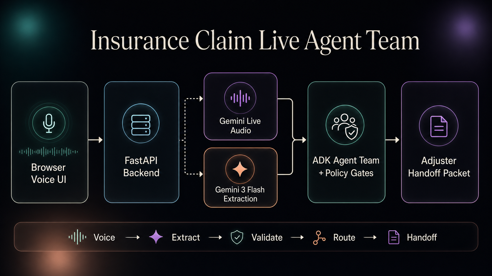

# Insurance Claim Live Agent Team
# 保险理赔实时 Agent 团队

A voice-first insurance claim intake app that lets a claimant talk naturally while the agent builds a structured claim packet in real time. The UI shows the live conversation, extracted claim facts, operator guidance, missing items, and an adjuster-ready handoff.

这是一个语音优先的保险理赔受理应用。理赔申请人可以自然对话，Agent 会实时构建结构化理赔资料包。界面会展示实时对话、提取出的理赔事实、操作员指引、缺失信息，以及可交接给理赔员的资料包。

This is designed as a realistic first notice of loss (FNOL) workflow: the claimant does not need to fill out a rigid form, and the operator does not need to manually translate a messy conversation into claim fields.

该应用模拟真实的首次损失通知（FNOL）流程：申请人不需要填写僵硬表单，操作员也不需要手动把杂乱对话整理成理赔字段。



## Features
## 功能特性

### Voice + Text Claim Intake
### 语音 + 文本理赔受理

- Native voice conversation with the claim intake agent
- 与理赔受理 Agent 进行原生语音对话
- Real-time transcript for claimant and agent turns
- 实时展示申请人与 Agent 的对话转写
- Text input fallback for typed claim details
- 支持文本输入作为补充方式，用于录入理赔细节
- Live audio responses from the agent
- Agent 可实时返回语音回答

### Real-Time Claim Packet
### 实时理赔资料包

- Automatically extracts claimant name, contact method, policy number, loss type, date, location, description, safety details, evidence, and report numbers
- 自动提取申请人姓名、联系方式、保单号、损失类型、日期、地点、描述、安全细节、证据和报告编号
- Updates the claim state as the conversation progresses
- 随着对话推进持续更新理赔状态
- Highlights missing or uncertain information
- 标记缺失或不确定的信息
- Builds an adjuster handoff packet while the call is still happening
- 在通话过程中同步生成可交接给理赔员的资料包

### Operator Guidance
### 操作员指引

- Shows the current claim disposition
- 展示当前理赔处置状态
- Suggests the next best question or confirmation
- 建议下一步最合适的问题或确认项
- Lists blocking items before handoff
- 在交接前列出阻塞项
- Separates the operator-facing summary from the lower-level audit trail
- 将面向操作员的摘要与底层审计记录分开

### Insurance-Specific Routing
### 保险场景专用路由

- Handles home water damage, auto collision, theft/property loss, travel claims, medical reimbursement examples, and unclear claims
- 支持家庭水损、车祸碰撞、盗窃/财产损失、旅行理赔、医疗报销示例和不明确理赔
- Applies deterministic evidence and document checks
- 应用确定性的证据和文件检查
- Flags injury, safety, habitability, timing, SIU, and escalation signals
- 标记受伤、安全、宜居性、时间、SIU 和升级处理信号
- Avoids promising coverage, payment, or liability
- 避免承诺承保范围、赔付或责任认定

## App Engine
## 应用引擎

The app combines live voice, an ADK graph, structured extraction, and deterministic insurance rules:

该应用结合了实时语音、ADK 图、结构化提取和确定性保险规则：

| Layer | Model / Engine | Purpose |
| --- | --- | --- |
| Live voice | `gemini-3.1-flash-live-preview` | Voice-to-voice conversation, audio responses, and transcription |
| 实时语音 | `gemini-3.1-flash-live-preview` | 语音到语音对话、音频回答和转写 |
| ADK graph | `root_agent` in `agent.py` | Source of truth for claim normalization, classification, validation, routing, and packet generation |
| ADK 图 | `agent.py` 中的 `root_agent` | 理赔规范化、分类、校验、路由和资料包生成的事实来源 |
| Structured extraction | `gemini-3-flash-preview` | Converts messy claim language into structured claim facts inside the ADK graph |
| 结构化提取 | `gemini-3-flash-preview` | 在 ADK 图中把杂乱理赔表述转换为结构化理赔事实 |
| Business rules | Python FunctionNodes + Pydantic | Deterministic missing-field checks, evidence gates, safety routing, SIU signals, and handoff packet output |
| 业务规则 | Python FunctionNodes + Pydantic | 确定性缺失字段检查、证据门控、安全路由、SIU 信号和交接资料包输出 |
| App backend | FastAPI | Serves the frontend, manages WebSocket audio, and calls `run_claim_workflow()` from `agent.py` after each claimant turn |
| 应用后端 | FastAPI | 提供前端服务、管理 WebSocket 音频，并在每轮申请人输入后调用 `agent.py` 中的 `run_claim_workflow()` |
| Frontend | HTML, CSS, JavaScript | Dark professional live cockpit for voice, transcript, claim state, and handoff |
| 前端 | HTML, CSS, JavaScript | 深色专业实时工作台，用于展示语音、转写、理赔状态和交接信息 |

## How It Works
## 工作原理

`agent.py` owns the production claim workflow. It exposes the ADK `root_agent` and a `run_claim_workflow()` helper that runs the graph programmatically for the live app.

`agent.py` 负责生产级理赔工作流。它暴露 ADK `root_agent`，并提供 `run_claim_workflow()` 辅助函数，让实时应用可以通过代码运行整张图。

`server.py` owns the live web transport. It manages the browser session, Gemini Live audio stream, transcripts, and FastAPI routes. It does not duplicate extraction, classification, evidence, routing, or packet logic.

`server.py` 负责实时 Web 传输。它管理浏览器会话、Gemini Live 音频流、转写和 FastAPI 路由，但不会重复实现提取、分类、证据、路由或资料包逻辑。

The live app flow is:

实时应用流程如下：

```text
Claimant speaks or types
        |
        v
server.py captures the turn
        |
        v
run_claim_workflow() executes root_agent
        |
        v
ADK graph runs LLM nodes + deterministic FunctionNodes
        |
        v
server.py renders the returned claim state in the UI
```

## Project Structure
## 项目结构

```text
insurance_claim_live_agent_team/
|-- agent.py
|-- schemas.py
|-- policies.py
|-- examples.py
|-- requirements.txt
|-- .env.example
|-- assets/
|   `-- insurance-claim-live-agent-team-architecture.png
|-- live_demo/
|   |-- index.html
|   |-- styles.css
|   |-- app.js
|   `-- server.py
`-- README.md
```

## How to Get Started
## 如何开始

From the app directory:

从应用目录开始：

```bash
cd voice_ai_agents/insurance_claim_live_agent_team
python3.12 -m venv .venv
source .venv/bin/activate
pip install -r requirements.txt
cp .env.example .env
```

Edit `.env` and set your Google API key:

编辑 `.env` 并设置你的 Google API Key：

```bash
GOOGLE_GENAI_USE_VERTEXAI=False
GOOGLE_API_KEY=your-google-api-key
```

## Run the App
## 运行应用

Start the backend and frontend server:

启动后端和前端服务：

```bash
python -m uvicorn live_demo.server:app --reload --host 127.0.0.1 --port 4177
```

Open the app:

打开应用：

```text
http://127.0.0.1:4177/index.html
```

Use the microphone button to start a live claim conversation, or type into the text box if microphone access is unavailable.

使用麦克风按钮开始实时理赔对话；如果无法使用麦克风，也可以在文本框中输入。
